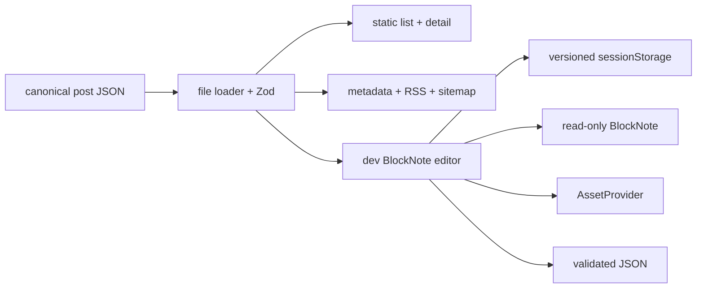
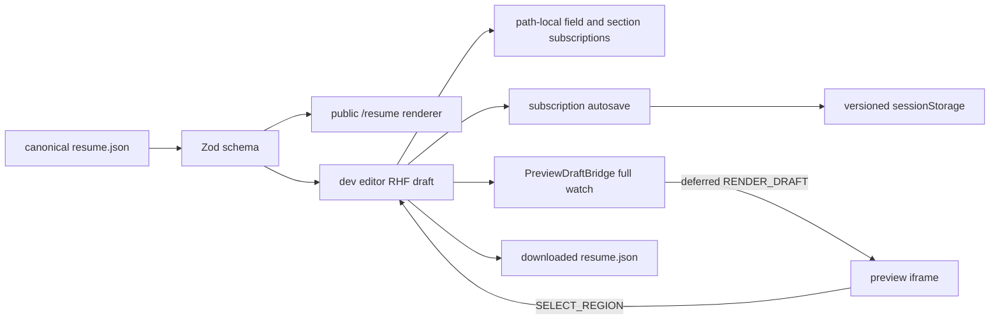

# 아키텍처

## 목적

개인 포트폴리오, 이력서와 기술 블로그를 GitHub Pages에서 제공하는 Next.js 애플리케이션이다. 서버 런타임 없이 정적 export로 배포하며 주요 콘텐츠는 저장소의 versioned JSON으로 관리한다.

## 렌더링 경계

App Router의 Server Component를 기본으로 사용한다. 테마, navigation, Accordion처럼 Hook이나 브라우저 API가 필요한 작은 경계만 Client Component로 둔다. 루트 layout은 공통 font와 theme provider를 제공한다.

## 레이어

- `src/app`: 라우트, layout, 페이지 전용 데이터와 컴포넌트
- `src/features`: 여러 화면에서 의미를 갖는 사용자 기능
- `src/shared`: 프레임워크와 페이지에 독립적인 UI, utility, style, font
- `public`: GitHub Pages가 그대로 제공하는 정적 자산

현재 레이어 이름은 Feature-Sliced Design과 유사하지만 완전한 FSD 규칙을 강제하지 않는다. 실제 의존 방향과 페이지 근접성을 우선한다.

## 데이터 흐름

`/resume`은 Zod schema로 검증한 `_data/resume.json`을 template registry의 `classic` renderer에 전달한다. `/blog`는 `_data/posts/*.json`을 검증해 목록, 정적 글 상세, RSS와 sitemap에 전달한다. JSON이 canonical source이며 stable ID가 public renderer와 개발 편집기의 연결 경계다. 외부 API, 원격 cache와 전역 store는 사용하지 않는다.

## 블로그 경계

`(pages)/blog`는 post schema, file loader, 정적 renderer와 feed를 소유한다. 공개 renderer는 BlockNote package를 client에 싣지 않고 승인된 BlockNote JSON을 React HTML로 변환한다. `(dev)/blog-editor`만 BlockNote runtime을 사용해 editable surface와 같은 schema의 read-only preview를 렌더링한다.

편집 초안은 현재 tab의 `sessionStorage`에 versioned envelope로 저장한다. strict schema와 `AssetProvider` 검증을 통과한 JSON만 download할 수 있으며 canonical file 교체는 수동이다. 현재 file loader와 JSON export helper는 향후 API read/write adapter의 교체 경계이고, `LocalPublicAssetProvider`는 향후 S3 provider를 추가하는 asset 경계다.

## 이력서 편집 경계

`(pages)/resume`은 schema, canonical data와 template registry를 소유한다. `(dev)/resume-editor`는 하나의 React Hook Form 인스턴스를 소유하고, field와 열린 section은 필요한 path만 구독한다. render와 분리된 draft session subscription이 현재 tab의 versioned `sessionStorage`를 갱신하고, `PreviewDraftBridge`만 전체 draft를 watch해 current asset 검증과 deferred preview를 만든다. 기술 카탈로그와 선택 picker의 대량 입력은 disclosure를 열 때만 마운트한다.

별도 `(dev)/resume-preview` iframe은 same-origin 검증된 message protocol만 받고, 선택 모드의 region click만 editor로 돌려준다. 브리지가 deferred region의 소유 section도 함께 계산하므로 편집 중 항목이 사라져도 안정 ID 기반 fallback을 유지한다.

이력서와 블로그 편집 route, preview protocol과 session token은 production compile에서 제외되고 static export에 나타나지 않는다. 내려받은 JSON을 검토해 canonical file로 교체하는 단계는 의도적으로 수동이다.

## 배포

`next.config.mjs`의 `output: 'export'`가 `out/`을 생성한다. GitHub Pages 공식 Actions가 결과를 게시한다. BlockNote와 Shiki가 포함된 graph의 일관된 compile을 위해 개발·build는 webpack compiler를 명시한다. 배포 절차는 [GitHub Pages 가이드](../how-to/github-pages-deployment.md)를 따른다.
