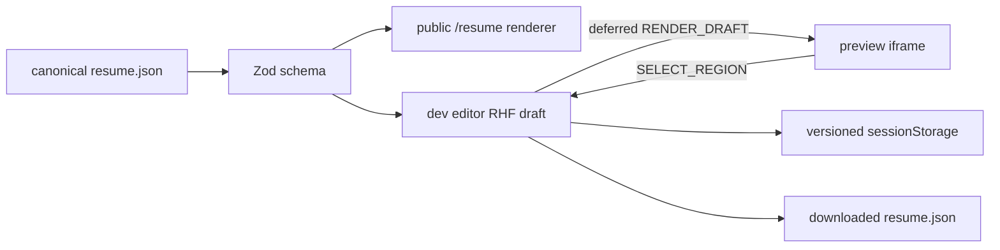

# 아키텍처

## 목적

개인 포트폴리오와 이력서를 GitHub Pages에서 제공하는 Next.js 애플리케이션이다. 서버 런타임 없이 정적 export로 배포하며 페이지 콘텐츠는 저장소의 TypeScript 상수에서 관리한다.

## 렌더링 경계

App Router의 Server Component를 기본으로 사용한다. 테마, navigation, Accordion처럼 Hook이나 브라우저 API가 필요한 작은 경계만 Client Component로 둔다. 루트 layout은 공통 font와 theme provider를 제공한다.

## 레이어

- `src/app`: 라우트, layout, 페이지 전용 데이터와 컴포넌트
- `src/features`: 여러 화면에서 의미를 갖는 사용자 기능
- `src/shared`: 프레임워크와 페이지에 독립적인 UI, utility, style, font
- `public`: GitHub Pages가 그대로 제공하는 정적 자산

현재 레이어 이름은 Feature-Sliced Design과 유사하지만 완전한 FSD 규칙을 강제하지 않는다. 실제 의존 방향과 페이지 근접성을 우선한다.

## 데이터 흐름

`/resume`은 Zod schema로 검증한 `_data/resume.json`을 template registry의 `classic` renderer에 전달한다. JSON이 canonical source이며 section과 item의 stable ID가 public renderer와 개발 편집기의 연결 경계다. 외부 API, 원격 cache와 전역 store는 사용하지 않는다.

## 이력서 편집 경계

`(pages)/resume`은 schema, canonical data와 template registry를 소유한다. `(dev)/resume-editor`는 React Hook Form이 소유한 draft를 deferred preview와 현재 tab의 versioned `sessionStorage`에 전달한다. 별도 `(dev)/resume-preview` iframe은 same-origin 검증된 message protocol만 받고, 선택 모드의 region click만 editor로 돌려준다.

편집 route와 protocol은 production compile에서 제외되고 static export에 나타나지 않는다. 내려받은 JSON을 검토해 canonical file로 교체하는 단계는 의도적으로 수동이다.

## 배포

`next.config.mjs`의 `output: 'export'`가 `out/`을 생성한다. `gh-pages`가 `.nojekyll`과 함께 결과를 GitHub Pages에 게시한다. 배포 절차는 [GitHub Pages 가이드](../how-to/github-pages-deployment.md)를 따른다.
