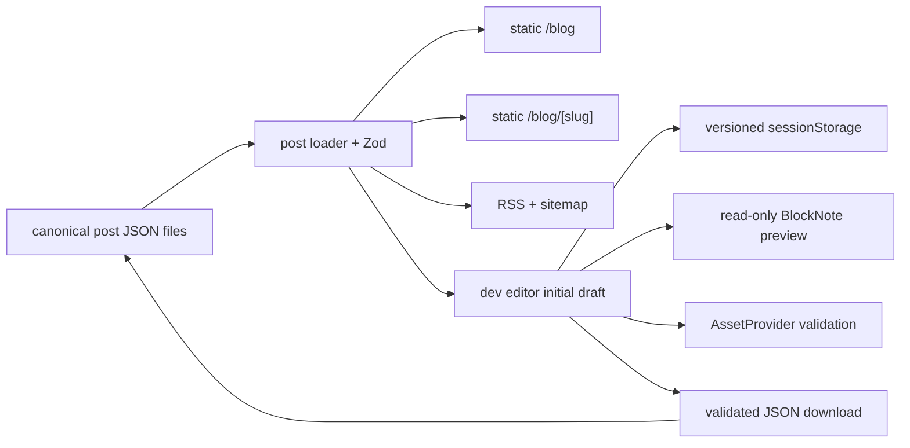

# 로컬 기술 블로그 설계

## 상태와 결정

- 상태: 승인·구현 완료
- 공개 방식: 저장소 JSON을 build 시 검증해 GitHub Pages 정적 HTML로 export
- 편집 방식: development server에서만 제공하는 로컬 편집기
- 편집 엔진: BlockNote 0.51.4
- 화면: desktop 40:60 편집/프리뷰, mobile tab 전환
- 초안: 같은 browser tab의 versioned `sessionStorage`
- 결과 반영: 검증된 JSON download 후 canonical file을 수동 교체
- 확장 방향: post loader, asset provider, export adapter 경계에서 S3+API로 교체

## 목표

1. 여러 기술 글을 목록·검색·태그로 탐색하고 정적 상세 페이지로 읽는다.
2. 로컬 편집기에서 metadata와 제한된 BlockNote 본문을 작성하면서 실제 모양을 함께 확인한다.
3. 편집 중 새로고침에도 같은 tab의 초안을 복구하고, 저장소를 자동 변경하지 않은 채 JSON을 내보낸다.
4. 공개 글은 SEO metadata, sitemap, RSS, 목차, 코드 highlight와 복사를 제공한다.
5. production 산출물에는 편집 route, 초안 key와 editor bundle이 포함되지 않는다.

## 범위 밖

- 로그인, 권한, 다중 작성자와 실시간 협업
- 서버 DB, 즉시 발행, 댓글, analytics
- Markdown round-trip과 WYSIWYG HTML 저장
- 이미지 업로드·변환 pipeline
- 공개된 slug 변경과 redirect 관리

## 정보 구조와 route

| URL                          | 역할                             | runtime          |
| ---------------------------- | -------------------------------- | ---------------- |
| `/blog`                      | 검색·태그를 포함한 공개 글 목록  | static export    |
| `/blog/[slug]`               | 정적 글 본문, 목차, 코드 복사    | static export    |
| `/blog/rss.xml`              | 공개 글 RSS                      | static export    |
| `/sitemap.xml`               | 공개 route와 글 URL              | static export    |
| `/blog-editor`               | canonical 글과 session 초안 관리 | development only |
| `/blog-editor/edit?postId=…` | 새 글·기존 글 편집               | development only |

편집 상세는 `output: export`가 dynamic development segment와 server `searchParams` 사용을 제한하므로 정적 route와 client query resolver를 사용한다.

## 공개 UX

### 목록

- 제목, 요약, 발행일, 태그를 표시한다.
- 검색은 제목·요약·태그를 대소문자 구분 없이 검사한다.
- 태그 button은 단일 선택이며 검색과 함께 적용한다.
- 결과가 없을 때 명시적인 empty state를 표시한다.

### 상세

- 제목, 요약, 태그, 발행일, 계산된 읽기 시간을 표시한다.
- H2~H4를 stable block ID 기반 anchor와 목차로 만든다.
- desktop은 sticky 우측 목차, mobile은 접을 수 있는 본문 목차를 사용한다.
- 코드 block은 build 시 highlight하고 client enhancement로 복사 button을 추가한다.
- 공개 renderer는 BlockNote runtime에 의존하지 않고 React static markup을 생성한다.

## 편집 UX

### 관리 화면

- canonical 글과 현재 tab의 session-only 초안을 함께 표시한다.
- 상태, 제목, slug, 수정일과 session 초안 여부를 구분한다.
- 새 글은 UUID, 오늘 날짜와 빈 paragraph로 시작한다.

### 편집 화면

- desktop: 좌측 40% metadata+editable BlockNote, 우측 60% read-only BlockNote.
- mobile: 편집/프리뷰 tab 중 하나만 표시하고 ArrowLeft/ArrowRight/Home/End를 지원한다.
- 상단에는 글 관리 link, 저장 시각, 초기화와 JSON 내보내기를 둔다.
- preview는 iframe이 아니라 동일 BlockNote schema의 read-only surface다.

### metadata

- `title`: 필수, 120자 이하
- `slug`: 제목에서 자동 제안하지만 사용자가 직접 수정 가능
- 공개 전: 제목을 따라가다가 사용자가 수정한 순간 자동 덮어쓰기를 중지
- 공개 후: canonical slug를 잠가 URL 파손을 방지
- `summary`: 필수, 240자 이하
- `status`: `draft | published`; published는 발행일 필수
- `tags`: 최대 8개, 항목 30자 이하, 대소문자 무시 중복 금지
- `coverImage`: local public asset source, alt, optional caption
- `updatedAt`, `publishedAt`: ISO date

## BlockNote schema

저장 형식은 BlockNote JSON을 canonical로 사용한다. 사용자 입력 범위를 다음 block으로 제한한다.

- paragraph
- H2, H3, H4
- bullet, numbered, check list
- quote
- code
- table
- image
- divider

H1은 문서 제목이 소유한다. 공개 renderer는 연속 list item을 하나의 semantic list로 묶고, 외부 link에는 안전한 target/rel을 적용한다. 이미지에는 대체 텍스트가 필요하다.

## 데이터와 저장 경계

`schemaVersion: 1` 글은 stable UUID, metadata, `blocks`를 가진다. canonical file은 `src/app/(pages)/blog/_data/posts/<slug>.json`에 한 글씩 둔다. loader는 모든 file을 Zod로 검증하고 ID·slug 중복, 공개일, public asset 존재를 확인한다.

### S3+API 전환

현재 file loader 함수가 post read port, JSON download helper가 write port 역할을 한다. API 전환 시 API/S3 adapter가 같은 `BlogPost` schema를 반환·수신하도록 하고 목록, 상세, editor component는 유지한다.

이미지는 `AssetProvider`가 preview URL 해석과 존재 검증을 소유한다. 현재 `LocalPublicAssetProvider`만 등록하지만, 다음 schema version에서 discriminated `s3` source를 추가하고 provider registry에 S3 adapter를 등록할 수 있다. migration 동안 `public` source는 계속 읽는다.

전환 단계는 다음과 같다.

1. API가 schema version과 ETag/version을 포함해 글을 읽고 쓴다.
2. file loader 뒤에 API repository adapter를 추가한다.
3. JSON download action을 API save/publish adapter로 교체한다.
4. S3 presigned upload와 asset source adapter를 추가한다.
5. build-time fetch 또는 webhook build를 선택한다.

## 오류와 안전

- 손상됐거나 다른 version의 session envelope는 삭제하고 canonical로 복구한다.
- export 전에 strict post schema와 모든 asset을 재검증한다.
- 공개 slug는 canonical 값과 다르면 export를 차단한다.
- 허용하지 않는 link scheme과 `/blog/` 밖 local asset을 거부한다.
- loader 오류는 file 이름과 schema path를 포함해 build를 실패시킨다.
- editor route와 storage token은 production static export 검사에서 금지한다.

## 검증 기준

- schema, slug, loader, TOC/feed, renderer, session, export, asset과 BlockNote schema unit test
- 목록 검색/태그 component test
- metadata 자동 slug·수동 수정·공개 slug lock test
- desktop 40:60, mobile keyboard tab, session restore와 JSON download E2E
- public detail과 editor screenshot 회귀
- typecheck, lint, unit, format, production build, static exclusion, full E2E 통과
